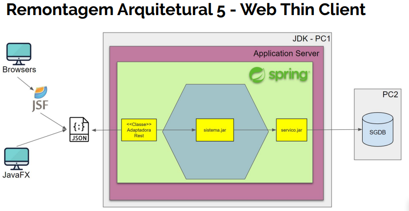

# Remontagem 5 - Web Mobile Thin Client

**Objetivos**  
A quinta remontagem arquitetural é fazer o front-end web mobile da transferência bancária    
funcionar como: ***thin client REST do microservices**.
- Backend Spring totalmente removido
- Nesse projeto somente o FrontEnd será implementado (View)

**Definição arquiteturais**
1. Escolher um servidor de aplicação.
2. Escolher um framework de microservices.
3. Implementar um novo adaptador primário que
   receba os dados via REST, repassando os input
   para mesma porta primária já existente, para
   processar a lógica da operação dentro do
   hexágono

**Definições de Design**  
Implementa o modulos controler REST
- Executado dentro do Application Java Server
- Micro profile Web
- Artefato de software gerado (.war)

**Ambiente**
- Java 12 (Jakarta EE server faces)
- IDE Intellij
- Maven
- BD HSQLDB (Embedded)
- Apache TomEE (Embedded) - porta 8090
- Web Micro Profile REST (Embeded)
- Spring Web REST
- Swagger Micropofile UI (Doc rest API)
- Jackson databind (provedor json)
- JSF
- Primefaces

**Dependências Negócio(Hexagono)**
- Não tem. Acesso sera via endpoint REST do projeto de microserviço.

**Dependências Backservices(infra)**
- Não tem.

**Dependências Tecnologicas**  
CDI beans do java EE

**Arquivos de Configuração**

1. web.xml
2. beans.xml
3. faces-config.xml

1.1 web.xml  
Arquivo de configuração do WebServlet do Java.
Faz a chamada inicial do sistema web.
Le o configuração doo contexto e acesso as arquivos de configuração.

Utilizado também para:
- Subir o Container Java EE
- Configrar Timeout do sistema
- Configurar a pagina inicial do sistema
- Ativar as configuração do JSF
- Alterar o thema da aplicação

2.1 beans.xml  
Arquivo de configuração do CDI, container do Java EE

3.1 faces-config.xml
Arquivo de configuraçãp padrãoo do Java Server faces
utilizado para inserir as configurações de outros frameworks,
spring por exemplo.

**Pacotes**  
conta.jsf-   Contém a implementação do adaptador JSF      
conta.to  - contem as classe de objetos de tranferencia

***Recursos Microprofile***
1. RestTemplate

**Outros Arquivos**  
Pasta webapp:  
estilo.css - Style css   
transferencia.xhml  - implementação da View em primefaces  
